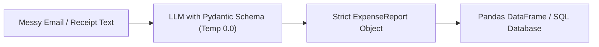
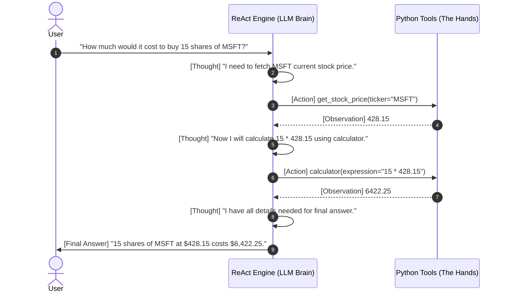

# 🎓 Hands-on AI Agents Lab: Programmable AI & Autonomous Systems
> **Open Source Development Program — Session 22**

Welcome to the **Programmable AI and AI Agents Practical Lab**. This repository provides an end-to-end hands-on curriculum that takes students from standard conversational AI to building production-grade, deterministic software pipelines and autonomous tool-using agents.

---

## 🧭 Course & Slide Deck Mapping

| Module | Slide Deck Topic | Hands-On Implementation / File |
| :--- | :--- | :--- |
| **Module 1** | **The API Layer & Roles** | `system`, `user`, `assistant` roles & `temperature=0.0` determinism |
| **Module 2** | **Prompting for Software** | Overcoming "The Parsing Problem" using **Pydantic Schemas** |
| **Module 3** | **Lab 1: The Expense Parser** | [`lab1_expense_parser.py`](file:///Users/akash.meruva/Documents/Projects-cd/AI/AI%20Agents/lab1_expense_parser.py) & [Notebook Part 1](file:///Users/akash.meruva/Documents/Projects-cd/AI/AI%20Agents/AI_Agents_HandsOn_Lab.ipynb) |
| **Module 4** | **Rise of the Agents & ReAct** | Breaking "The Wall" with the **Reason $\rightarrow$ Act $\rightarrow$ Observe** loop |
| **Module 5** | **Giving AI Hands (Tools)** | Python `@tool` definitions with docstrings & type signatures |
| **Module 6** | **Lab 2: The Market Agent** | [`lab2_market_agent.py`](file:///Users/akash.meruva/Documents/Projects-cd/AI/AI%20Agents/lab2_market_agent.py) & [Notebook Part 2](file:///Users/akash.meruva/Documents/Projects-cd/AI/AI%20Agents/AI_Agents_HandsOn_Lab.ipynb) |
| **Module 7** | **Multi-Agent Systems** | [`lab3_multi_agent_system.py`](file:///Users/akash.meruva/Documents/Projects-cd/AI/AI%20Agents/lab3_multi_agent_system.py) (Researcher $\rightarrow$ Analyst Handoffs) |

---

## 🚀 Quick Start for Students

### 1. Create Virtual Environment & Install Dependencies
```bash
cd "AI Agents"
python3 -m venv venv
source venv/bin/activate  # On Windows: venv\Scripts\activate
pip install -r requirements.txt
```

### 2. Configure API Keys
Create your `.env` file (you only need **one** provider key, e.g. free Google Gemini, OpenAI, or Groq):
```bash
cp .env.example .env
# Edit .env and paste your GOOGLE_API_KEY, OPENAI_API_KEY, or GROQ_API_KEY
```

> **Note**: If no API key is provided, the labs automatically fall back to an interactive **Mock Simulation Mode** so students can still inspect the ReAct loop and schema validation offline!

### 3. Choose How You Want to Run

#### Option A: Streamlit Interactive Web Dashboard (Recommended for Demos & UI)
```bash
streamlit run app.py
```

#### Option B: Interactive Jupyter Notebook (Recommended for Step-by-Step Code)
```bash
jupyter notebook AI_Agents_HandsOn_Lab.ipynb
```

#### Option C: Standalone Terminal Scripts
Run individual lab components directly:
```bash
# Run Lab 1: The Expense Parser
python3 lab1_expense_parser.py

# Run Lab 2: The Market Agent (ReAct Loop)
python3 lab2_market_agent.py

# Run Lab 3: Multi-Agent Handoff System
python3 lab3_multi_agent_system.py
```

---

## 🧪 Detailed Lab Breakdown

### 🧪 Lab 1: The Expense Parser (Slide 11–13)
*Transform messy real-world text into strictly validated JSON records.*

- **The Problem**: Chatty LLMs output conversational text (`"Sure! Here is your output..."`) which immediately crashes `json.loads()`.
- **The Solution**: Pydantic schemas enforced via Structured Output APIs (`response_schema` in Gemini / `beta.chat.completions.parse` in OpenAI).



**Sample Input**:
> *"Bought a coffee for 4.50 at Starbucks yesterday, and spent $50 on gas at Shell. Also grabbed a quick burger at In-N-Out for 12.75 and bought $18.30 parking ticket at CityGarage."*

**Structured Output**:
```json
{
  "expenses": [
    {"vendor": "Starbucks", "amount": 4.50, "category": "Food & Beverage", "description": "Coffee"},
    {"vendor": "Shell", "amount": 50.00, "category": "Travel & Transportation", "description": "Gas"},
    {"vendor": "In-N-Out", "amount": 12.75, "category": "Food & Beverage", "description": "Burger"},
    {"vendor": "CityGarage", "amount": 18.30, "category": "Travel & Transportation", "description": "Parking"}
  ],
  "total_amount": 85.55
}
```

---

### 🧪 Lab 2: The Market Agent (Slide 24–27)
*An autonomous financial assistant that reasons and triggers real Python functions to solve multi-step market queries.*



#### Included Agent Tools:
1. `get_stock_price(ticker: str) -> float`: Live price lookup using `yfinance` with fallback caching.
2. `calculator(expression: str) -> float`: Safe mathematical parser using Python AST (prevents arbitrary code execution).
3. `search_market_news(query: str) -> str`: Real-time DuckDuckGo financial news search.
4. `save_portfolio_log(ticker: str, action: str, shares: float, total_cost: float) -> str`: File I/O persistence.

---

### 🤝 Lab 3: Multi-Agent Collaboration & Handoffs (Slide 23)
*Demonstrates specialization and agent handoffs:*
1. **Market Researcher Agent**: Discovers prices, volume, and news catalysts.
2. **Senior Financial Analyst Agent**: Evaluates risk/reward, calculates position sizing, and formats an **Executive Investment Memo**.

---

## 📁 Repository Structure

```
AI Agents/
├── README.md                           # This Comprehensive Lab Guide
├── AI_Agents_HandsOn_Lab.ipynb         # Interactive Jupyter Notebook (All 7 Modules)
├── lab1_expense_parser.py              # Standalone Lab 1 CLI & Pydantic Parser
├── lab2_market_agent.py                # Standalone Lab 2 ReAct Engine & Tools
├── lab3_multi_agent_system.py          # Standalone Lab 3 Multi-Agent Handoff Pipeline
├── requirements.txt                    # Python dependencies
├── .env.example                        # Template for API keys
├── .env                                # Local secrets file
└── sample_data/
    ├── messy_expenses.txt              # Sample chaotic emails & receipts for Lab 1
    └── market_test_prompts.txt         # Multi-step math & financial test queries
```

---

## 💡 Capstone Challenges for Students

1. **Challenge 1 (Currency Converter Tool)**:
   Add a `@tool def convert_currency(amount: float, from_curr: str, to_curr: str) -> float` to [`lab2_market_agent.py`](file:///Users/akash.meruva/Documents/Projects-cd/AI/AI%20Agents/lab2_market_agent.py) and test queries like *"What is the cost of 5 shares of AAPL in Euros?"*.
2. **Challenge 2 (Receipt Image Extractor)**:
   Extend [`lab1_expense_parser.py`](file:///Users/akash.meruva/Documents/Projects-cd/AI/AI%20Agents/lab1_expense_parser.py) to parse receipt photos using Gemini / GPT-4o multimodal vision capabilities.
3. **Challenge 3 (SQL Database Agent)**:
   Build an agent equipped with `run_sql_query(query: str)` to query an in-memory SQLite database of customer transactions.
